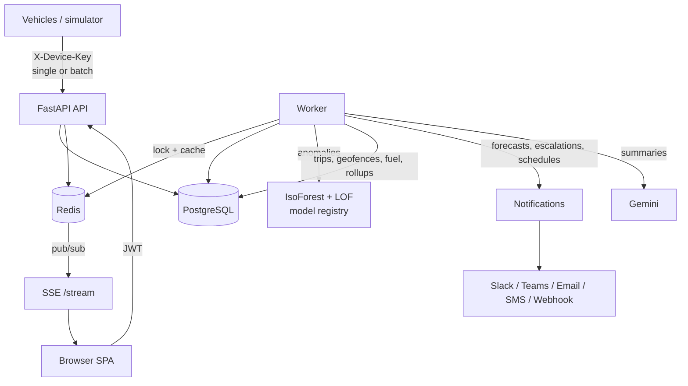

# VehicleWatch: fleet telemetry, predictive maintenance and operations

Fleet operators lose thousands per breakdown. The repair is rarely the big cost; the unplanned downtime, missed deliveries and roadside recovery are. VehicleWatch ingests sensor telemetry from every vehicle, finds abnormal behaviour with an unsupervised ML ensemble, **forecasts which vehicle will fail next and when**, explains each fault in plain English, and carries it through to a resolved work order. Catching a coolant leak at 112 °C instead of at 160 °C turns a £200 hose into something that never becomes a £12,000 engine rebuild.

It is a complete web application: a React single-page app served by a FastAPI backend, with PostgreSQL, Redis and a background worker.

---

## What's in the box

| Area | Capabilities |
|---|---|
| **Detection** | Isolation Forest + LOF ensemble on 10 features, z-score explanations, rule and OBD-II (DTC) fault classification, Gemini-written diagnoses with a rule-based fallback |
| **Prediction** | Remaining-useful-life forecasts per signal (engine temp, battery, vibration, oil, coolant, tyres), with time-to-limit and risk level |
| **Maintenance** | Work orders (kanban) raised from alerts or by hand; resolving one records root cause, cost and downtime, and labels the alert real or false. Preventive schedules by km or days auto-open work orders |
| **Operations** | Live map, trips, driver scorecards (harsh accel/brake, speeding, idling, over-rev), geofences (enter/exit/speeding, restricted zones), fuel economy, refuel and theft detection |
| **Alerting** | In-app feed plus Slack, Teams, email, SMS (Twilio) and webhooks; per-channel severity and event routing; escalation of unacknowledged CRITICAL alerts |
| **Insight** | Period reports (KPIs, maintenance spend, downtime, estimated cost avoided), CSV exports, detector precision per fault and vehicle, model registry with drift scores |
| **Platform** | Multi-tenant organizations, 5 roles, device API keys, offline batch backfill, real-time SSE stream, audit log, Prometheus metrics |

---

## Architecture



**Ingestion.** Devices POST readings with their own API key, either one at a time (`/api/v1/ingest/telemetry`) or as buffered batches of up to 500 (`/ingest/telemetry/batch`). Batches keep the device's timestamps, so data recorded out of coverage lands at the right time. A `(device, recorded_at)` unique constraint makes re-sends idempotent. Each reading updates a Redis latest-state cache and is published to the organization's live stream.

**Worker.** One cycle per minute (default):

1. For each device, in its own short transaction: anomaly scoring, then trip, geofence, fuel and hourly-rollup processing.
2. Gemini summaries run outside any transaction.
3. Notifications are delivered after commit.
4. Periodic jobs: escalation, forecasts, service schedules, retention, weekly report.

A Redis lock keeps cycles single-flight across replicas, and every watermark lives in PostgreSQL, so restarts resume exactly where they stopped. The worker runs inside the API process by default, or separately with `python -m app.workers.runner`.

**ML.** Models train on the most recent *clean* readings, meaning those before the scoring window that didn't raise an alert. Retraining happens when enough new data has arrived or the feature distribution drifts (PSI > 0.25), at most once an hour. Every version is stored HMAC-signed in `model_versions`, with Redis as a cache only. A tampered artifact is rejected before it is unpickled. Operators can **pin** a known-good model so a slowly degrading vehicle can't teach the detector that its degradation is normal. New vehicles are scored by a **class model** trained on their peers until they have history of their own. A vehicle's very first batch only establishes its baseline, and while a model is young it retrains each time its clean history doubles, so a cold start can't define "normal".

**Alerting.** A reading is abnormal when the Isolation Forest `decision_function` falls below `ANOMALY_SCORE_LOW` (0 is the contamination boundary; negative means outlier), **or** when a HIGH-confidence safety rule or OBD-II code fires. The rule path catches single-sensor faults, like a battery at 11.4 V, that barely move a 10-feature score. An alert is raised only when at least 3 of the last 5 readings are abnormal, so one-off sensor glitches are ignored, and then at most one per vehicle every 2 minutes.

---

## Quick start (Docker)

```bash
cp .env.example .env            # optional: add GEMINI_API_KEY, SMTP_*, TWILIO_*
docker compose --profile demo up --build
```

- App: http://localhost:8000. Sign in with `demo@vehiclewatch.io` / `demo-fleet-2026` (created by the simulator).
- API docs: http://localhost:8000/docs
- Metrics: http://localhost:8000/metrics

Without `--profile demo` you get API, worker, Postgres and Redis only. Sign up in the UI to create your own organization.

### The simulator

`simulator/device_simulator.py` sets up drivers, geofences and service schedules, issues each truck a device key, and drives five trucks around London:

| Vehicle | Behaviour | What lights up |
|---|---|---|
| Truck-Alpha | Healthy, careful driver | Control vehicle: high driver score, few alerts |
| Truck-Beta | Coolant leak: temp +4 °C every 20 readings, coolant level falling, DTC P0217 | Coolant-leak alerts, engine-temp forecast |
| Truck-Gamma | Failing alternator: −0.05 V every 15 readings, erratic RPM below 11.8 V, DTC P0562 | Battery forecast counting down, battery alerts |
| Truck-Delta | Transmission slip above 70 km/h (DTC P0730), aggressive driver, fuel siphoned while parked, route crosses the restricted zone | Transmission alerts, low driver score, theft events, geofence alerts |
| Truck-Echo | Wheel bearing: vibration rises with speed (DTC C0040); drops out of coverage and backfills | Wheel-bearing alerts, batch backfill |

```bash
python simulator/device_simulator.py --host http://localhost:8000 --interval 2
```

## Local development

```bash
# backend (needs Postgres + Redis; `docker compose up postgres redis` is easiest)
python -m venv .venv && .venv/Scripts/activate      # or source .venv/bin/activate
pip install -r requirements.txt
alembic upgrade head
uvicorn app.main:app --reload

# frontend (hot reload on :5173, proxies /api to :8000)
cd frontend && npm install && npm run dev

# tests (SQLite + in-memory Redis fake; no services needed)
pytest --cov=app
```

`npm run build` writes the SPA into `app/static/app`, and FastAPI serves it at `/`, with deep links falling back to `index.html`.

---

## Roles

| Role | Can |
|---|---|
| **Admin** | Everything, including users, organization settings, notification channels, vehicle deletion and the audit log |
| **Manager** | Vehicles, device keys, drivers, geofences, schedules, ML (pin and retrain), and deleting work orders |
| **Technician** | Update and resolve work orders |
| **Operator** | Acknowledge and label alerts, raise work orders, ingest telemetry |
| **Viewer** | Read-only |

Public sign-up always creates a **new** organization with the caller as its admin. Joining an existing organization requires an admin of that organization to create the account. Set `ALLOW_PUBLIC_SIGNUP=false` to disable sign-up entirely. Cross-organization lookups return 404, not 403.

## Connecting a real device

1. **Vehicles › (vehicle) › Settings › Issue key**. The key is shown once.
2. POST readings:

```bash
curl -X POST http://localhost:8000/api/v1/ingest/telemetry \
  -H "X-Device-Key: vw_ab12cd34_…" -H "Content-Type: application/json" \
  -d '{"gps_lat":51.51,"gps_lon":-0.12,"engine_temp":92,"rpm":1800,"fuel_level":64,
       "battery_voltage":13.9,"speed":58,"vibration":1.3,
       "oil_pressure":41,"coolant_level":95,"tire_pressure":104,"dtc_codes":["P0217"]}'
```

`recorded_at` is optional. If present it must be within the last 7 days and no more than 5 minutes in the future. Batches go to `/api/v1/ingest/telemetry/batch` as `{"readings": [...]}`.

## API overview

All routes are under `/api/v1`. Full interactive docs are at `/docs`.

| Group | Endpoints |
|---|---|
| Auth | `POST /auth/register`, `/auth/login`, `/auth/refresh`, `/auth/change-password`; `GET /auth/me` |
| Org & users | `GET/PATCH /organization`; `GET/POST /users`; `PATCH/DELETE /users/{id}`; `GET /audit-logs` |
| Devices | CRUD `/devices`; `GET /devices/live`; `POST/DELETE /devices/{id}/api-key` |
| Telemetry | `POST /ingest/telemetry[/batch]` (device key); `POST/GET /devices/{id}/telemetry[/batch]` |
| Alerts | `GET /alerts` (filters); `GET /alerts/{id}`; `PATCH /alerts/{id}/acknowledge`; `POST /alerts/{id}/feedback`; `POST /alerts/acknowledge` (bulk) |
| Analytics | `GET /analytics/fleet`, `/analytics/timeline`, `/analytics/forecast`, `/analytics/devices/{id}[/hourly\|/forecast]` |
| Maintenance | CRUD `/maintenance/work-orders`, `/maintenance/schedules` |
| Fleet ops | `/drivers`, `/drivers/scores`, `/trips`, `/trips/{id}/route`, `/geofences`, `/geofences/events`, `/fuel/stats`, `/fuel/events` |
| Notifications | `GET /notifications`; `POST /notifications/read-all`; CRUD `/notifications/channels`; `POST /notifications/channels/{id}/test` |
| ML | `GET /ml/models`, `/ml/active`, `/ml/metrics`; `POST /ml/models/{id}/pin\|unpin`; `POST /ml/devices/{id}/retrain` |
| Reports | `GET /reports/summary`; `GET /reports/export/{alerts\|trips\|work_orders\|fuel_events\|telemetry\|audit}` |
| Live | `POST /stream/ticket` → `GET /stream?ticket=` (Server-Sent Events) |

## Fault taxonomy

The classifier names every alert. Its HIGH-confidence matches also raise alerts on their own (the safety-limit path above). Rules are evaluated in priority order, and an OBD-II trouble code outranks every sensor rule.

| Fault | Signature |
|---|---|
| From DTC | P0115–P0128/P0217 coolant · P0560–P0622 battery · P07xx transmission · P0520–P0524 oil · P0300–P0306 misfire → engine stress · C0750–C0799 TPMS · C0035–C0050 wheel speed → bearing · other C-codes → brakes |
| `ENGINE_STRESS` | RPM > 3500 and temp > 100 °C |
| `LOW_OIL_PRESSURE` | Oil < 20 psi with engine above 900 RPM |
| `COOLANT_LEAK` | Temp > 110 °C, or coolant < 50 % with temp > 100 °C |
| `TRANSMISSION_STRESS` | RPM > 3200 above 60 km/h |
| `BATTERY_FAILURE` | Voltage < 11.8 V |
| `TIRE_PRESSURE` | Lowest tyre < 85 psi (calibrated for heavy trucks) |
| `WHEEL_BEARING` | Vibration > 6 g above 60 km/h with normal engine temp |
| `UNKNOWN_ANOMALY` | Anything else |

## Configuration

See [.env.example](.env.example). The main settings:

| Variable | Default | Purpose |
|---|---|---|
| `SECRET_KEY` | — | JWT signing and model-artifact HMAC. **Required (32+ chars) in production** |
| `ENVIRONMENT` | `development` | `production` enables strict CORS, https-only public webhooks and the secret check |
| `DATABASE_URL` / `REDIS_URL` | local | Connections |
| `RUN_WORKER_IN_API` | `true` | Run the worker inside the API process |
| `GEMINI_API_KEY` / `GEMINI_MODEL` | — / `gemini-flash-latest` | LLM summaries (optional) |
| `SMTP_*`, `TWILIO_*` | — | Email and SMS channels |
| `TELEMETRY_RETENTION_DAYS` | `90` | Raw telemetry retention; hourly rollups are kept |
| `ANOMALY_*` | see config | Training window, retrain cadence, drift threshold, score thresholds |
| `METRICS_TOKEN` | — | Protect `/metrics` |

## Security notes

- Passwords use bcrypt; login and sign-up are rate-limited per IP and email. Device keys are stored as SHA-256 hashes, and only a short prefix is kept in clear.
- The browser's live stream uses single-use 60-second tickets, so JWTs never appear in URLs.
- In production, webhook targets must be https and must not resolve to private, loopback or link-local addresses (SSRF guard).
- Security headers and request IDs are set on every response. Every sensitive action is written to the audit log.
